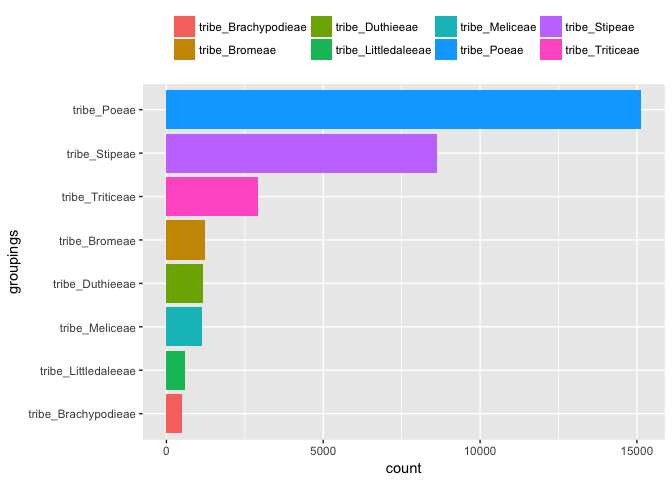

rePhylo: Re-investigating and improving phylogenies
================

<!-- README.md is generated from README.Rmd. -->

<!-- -->

## Overview

This package is to improve phylogenies based on phylogenies. One of the
main function is to select potential paralogs by given groupings /
constraints, and the users can perform another turn of phylogenetic
reconstructions for an improved phylogeny.

## Description and notes

`cladeFilter` reports tips as potential paralogs that violate the
groupings provided in `taxa` for each gene tree of `trees`. Users can
provide `taxa` directly, or generate one by `concor.node` and
`createGrouping`. **IMPORTANT NOTE:** The grouping/constraints must be
chosen very carefully. Avoid any aribitrary selections of particular
relatioships; suggested to use the well-confirmed relationship, unless
for special purpose.

## Installation

``` r
#install.packages("rePhylo")
```

## Usage and examples

First get the datasets:

``` r
data("Brassidata")
trees <- Brassidata$trees
taxa <- Brassidata$taxaTable
ref <- Brassidata$ref
```

`trees` contains all gene trees to be investigated as a list.

`taxa` is a `data.frame` that gives grouping information. The first
column must be tip names in any of the test trees (gene trees).

`ref` is a reference tree (when using **Method
1**)

#### Method 1

``` r
#concorn <- concor.node(ref = ref, trees = trees, bp = c(0, 30, 50), getTreeNames = FALSE)
#groups <- createGrouping(concor = concorn, percent = 0.7)
#head(groups)
```

#### Method 2

``` r

head(taxa)
##                                     tips clades
## 1            Rorippa_globosa_Cardamineae cladeA
## 2         Rorippa_sylvestris_Cardamineae cladeA
## 3             Rorippa_indica_Cardamineae cladeA
## 4 Leavenworthia_alabamica_ge_Cardamineae cladeA
## 5          Barbarea_vulgaris_Cardamineae cladeA
## 6       Cardamine_hirsute_ge_Cardamineae cladeA
```

## Details

...under construction

